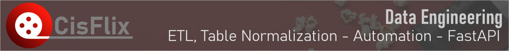
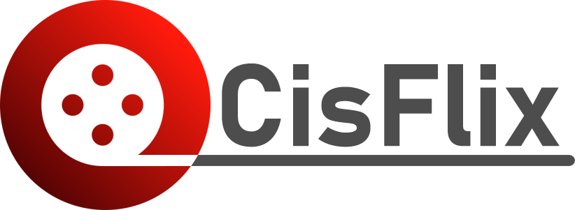
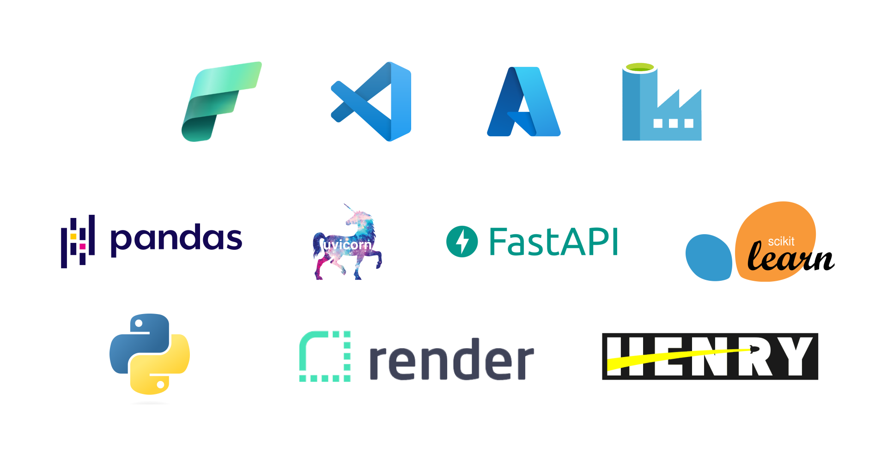

# Proyecto MVP de Recomendación de Películas con Proceso Integral de Data Science 🎬 
## CisFlix 

¡Bienvenidos al repositorio del Proyecto MVP de Recomendación de Películas, un emocionante proyecto que abarca todo el ciclo de vida del Data Science, desde la etapa de Data Engineering hasta la creación de una plataforma interactiva de recomendación de películas! En este README, vamos a desglosar cada fase del proceso y resaltar las tecnologías y herramientas utilizadas para llevar a cabo este proyecto.

## Fase de Data Engineering 🛠️

En la fase de Data Engineering, se estableció la base sólida para todo el proceso. Aquí se realizaron las tareas esenciales de extracción, transformación y carga de datos (ETL) utilizando Visual Studio Code y Microsoft Fabric. El proceso de ETL permitió la obtención de datos desde dos datasets que se encontraban en la nube de Google Drive y el cual se alimenta constantemente, y su posterior transformación para su uso en el sistema de recomendación.

Además, se llevó a cabo una meticulosa normalización de tablas, asegurando que los datos estén estructurados de manera coherente y lista para su análisis. La automatización de este proceso y el de ETL fue esencial para mantener la integridad de los datos en todo momento.

Uno de los aspectos destacados de esta fase fue la implementación de un sistema de cronjobs que no solo programaba y ejecutaba automáticamente flujos de trabajo, sino que también enviaba notificaciones por correo electrónico en caso de que se detectaran errores. Esta característica garantizó la continuidad del proceso y la detección temprana de problemas. Esto fue realizado en Microsoft Fabric - Data Factory - Data Engineering.

### Plataforma Interactiva de Recomendación con FastAPI 🚀

La siguiente fase del proyecto implicó la creación de una plataforma interactiva de recomendación de películas utilizando FastAPI, una moderna y eficiente herramienta para la construcción de APIs. FastAPI se conectó de manera fluida con HTML a través del motor de plantillas Jinja2, permitiendo la generación dinámica de contenido web basado en los resultados del análisis de datos.

La integración de Uvicorn, un servidor web de alto rendimiento, aseguró que la plataforma fuera rápida y receptiva, brindando una experiencia fluida a los usuarios que buscan recomendaciones de películas personalizadas.

### Publicación y Colaboración 🌐

El repositorio de este proyecto se encuentra alojado en GitHub, facilitando la colaboración y el seguimiento de versiones. Además, se utilizó Render para la publicación de la plataforma interactiva en línea, permitiendo que los usuarios accedan fácilmente a las recomendaciones de películas generadas por el sistema.

### Futuras Mejoras y Actualizaciones 🚀

Estamos comprometidos en continuar mejorando y expandiendo nuestro Proyecto MVP de Recomendación de Películas en los siguientes aspectos:
#### 1. Mejoras en el Frontend 👁️‍🗨️
#### 2. Mejoras en el Código 🧑‍💻
#### 3. Mejoras en el Proceso de ETL 🔄
#### 4. Actualización de Plataformas 🚀

Agradecemos tu interés y apoyo en nuestro proyecto. Estas futuras mejoras y actualizaciones reflejan nuestro compromiso de proporcionar una plataforma de recomendación de películas cada vez más robusta y emocionante. ¡Mantente atento a nuestras actualizaciones y no dudes en compartir tus comentarios y sugerencias!

## Mapa del Sitio

| Carpeta                   | Función                   | Recurso           | Video
|:--------------------------|:----------------------------------------------:|:-------------:|:-------------
| data                      | Carpeta Raiz  de los datasets en general                              |
| data/anomalies            | Contiene errores de datasets y solución                               |
| data/beta                 | Contiene los dataset con una primera ronda de limpieza                |
| data/launch               | Contiene los dataset con tablas normalizadas a producción             |
| data/ML                   | Contiene el dataset pregrabado de recomendaciones                     |
| data/original             | Contiene la copia de los ultimos dataset extraidos                    |
| EDA                       | Contiene el analisis exploratorio de datos de los datasets                    |
| media                     | Contiene archivos de diseño gráfico, animación o video                |
| model                     | Almacena los diferentes modelos de recomendación                      | | [Video](#) 
| public                    | Carpeta Raiz para publicar en la web                                  |
| public/static             | Carpeta Raiz para Jinja2 archivos css, img y js                       |
| public/static/css         | Almacena archivos de estilos .css                                     |
| public/static/img         | Almacena las imágenes usadas en html                                  |
| public/static/js          | Almacena los script en JavaScript o JQuery                            |
| public/templates          | Plantilla de Jinja2 html                                              |
| source/img                | Almacena imágenes y elementos gráficos internos                       |
| .gitignore                | Archivo para evitar la subida de algunas carpetas o archivos a GitHub |
| clean_data_beta.ipynb     | Notebook de limpieza automatizada 1                                   |   
| clean_data_launch.ipynb   | Notebook de limpieza y normalización de tablas                        |
| functions.py              | Funciones necesarias para FastAPI                                     |
| main.py                   | Archivo de la aplicación FastAPI                                      |
| requeriments.txt          | Requerimientos para instalar en Render                                |

## Ingeniería a flor de piel.
*En esta sección encontrarás los casos de ingeniería vanzada, los cuales inicialmente fueron un obstáculo para que el proyecto siguiera adelante*
>1. Datos mal estructurados del dataset (no coinciden en sus respectivas columnas)

Debemos tener en cuenta que vamos a implementar automatización de datos de inicio a fin y este obstaculo debe ser superado de forma automática, aunque el reintegro de esos datos si es que sirven debe hacerse de forma manual en un dataset llamado

## Recursos Importantes

[FastAPI - Jinja2](https://www.youtube.com/watch?v=_YJLpJp4xq8)
 
[Templates - FastAPI - Jinja2](https://fastapi.tiangolo.com/es/advanced/templates/)

### Futuro Desarrollo de un Dashboard con Power BI 📊

En nuestra búsqueda continua de enriquecer la experiencia de usuario y proporcionar insights valiosos, estamos emocionados de compartir nuestros planes para la próxima fase del proyecto en el área de Análisis de Datos.

Hasta ahora, hemos concentrado nuestros esfuerzos en Data Engineering, Data Science y Machine Learning para garantizar que los cimientos de nuestro proyecto sean sólidos y escalables. Gracias al exhaustivo trabajo de normalización y transformación de datos que hemos llevado a cabo, hemos creado una base de datos estructurada y coherente que es esencial para un análisis efectivo.

En nuestra próxima actualización, tenemos como objetivo crear un Dashboard interactivo utilizando Power BI. Aprovecharemos la calidad de los datos normalizados para visualizar tendencias, patrones y estadísticas relevantes sobre las películas y las preferencias de los usuarios. Este Dashboard no solo brindará una visión intuitiva de los datos, sino que también permitirá a los usuarios explorar la información de manera más profunda y tomar decisiones informadas sobre sus selecciones de películas.

El uso de Power BI nos permitirá presentar de manera efectiva el trabajo de Data Engineering y Data Science que hemos realizado hasta ahora. Este Dashboard actuará como una ventana al mundo de las recomendaciones de películas, mostrando cómo nuestras tecnologías y metodologías están trabajando en conjunto para ofrecer una experiencia de usuario excepcional.

Mantente atento a futuras actualizaciones en nuestro repositorio, ya que compartiremos más detalles sobre la creación y lanzamiento de este emocionante Dashboard con Power BI. Tu apoyo y entusiasmo son fundamentales para impulsar nuestro proyecto hacia adelante. Si tienes alguna sugerencia o comentario sobre esta próxima fase, no dudes en compartirlo. ¡Estamos ansiosos por seguir avanzando y brindarte lo mejor en recomendación de películas y análisis de datos!

### Modelos de Recomendación 🤖

#### Modelo 1: Amplio y Complejo

- **Características:**
  - Uso de Título, Género, Descripción y Popularidad.
  - Complejidad en cálculos de similitud y procesamiento.
  - Recomendaciones detalladas y ricas.

- **Problemas:**
  - Consumo elevado de memoria y tiempo en cálculos.
  - Largos tiempos de respuesta y posibles errores de memoria.

- **Soluciones:**
  - Implementación de pregrabación de recomendaciones en un archivo CSV.
  - Uso de Microsoft Azure Fabric para procesos de precomputación.

- **Objetivo:**
  - Generar recomendaciones altamente personalizadas basadas en múltiples atributos.
  - Ofrecer opciones detalladas y variadas a los usuarios.

#### Modelo 2: Eficiente y Focalizado

- **Características:**
  - Enfocado en Título y Descripción.
  - Uso de medidas de similitud más livianas.
  - Enfoque en eficiencia y reducción de cálculos.

- **Problemas:**
  - Sacrificio de diversidad en las recomendaciones.

- **Soluciones:**
  - Precomputación de matrices de similitud para acelerar el proceso.
  - Simplificación del preproceso y algoritmo.

- **Objetivo:**
  - Optimizar el tiempo de ejecución y el consumo de memoria.
  - Brindar recomendaciones rápidas y aceptables, aunque menos diversas.

En ambos modelos, el objetivo es generar recomendaciones de 5 películas para los usuarios. Si bien el primer modelo se centra en brindar recomendaciones detalladas y precisas basadas en múltiples atributos, el segundo modelo se esfuerza por ser rápido y eficiente en términos de cálculos y tiempo de respuesta. Ambos enfoques tienen sus ventajas y limitaciones, y como objetivo final, buscamos equilibrar la calidad y la eficiencia en nuestras recomendaciones.

> Puedes revisar más documentación en la carpeta `model` allí se especifica cómo funciona cada modelo, ventajas y desventajas.

## Integración Completa de Tecnologías 🛠️

En la implementación de nuestro proyecto, aprovechamos la potencia de FastAPI junto con las capacidades de Jinja2, HTML, JavaScript y AJAX para crear una interfaz de usuario interactiva y eficiente. A continuación, describiremos en detalle cómo abordamos la implementación de las 6 funciones de los endpoints solicitados y cómo logramos integrarlas con la interfaz de usuario:

### Implementación de los Endpoints
**`peliculas_idioma(Idioma: str):`**
- Recibe un idioma como parámetro y devuelve la cantidad de películas producidas en ese idioma.

**`peliculas_duracion(Pelicula: str):`**
- Recibe una película como parámetro y devuelve la duración y el año.

**`franquicia(Franquicia: str):`**
- Recibe una franquicia como parámetro y retorna la cantidad de películas, ganancia total y promedio.

**`peliculas_pais(Pais: str):`**
- Recibe un país como parámetro y retorna la cantidad de películas producidas en ese país.

**`productoras_exitosas(Productora: str):`**
- Recibe una productora como parámetro y retorna el revenue total y la cantidad de películas que realizó.

**`get_director(nombre_director):`**
- Recibe el nombre de un director y devuelve su éxito y una lista de películas dirigidas por él con detalles.

**`recomendacion(titulo):`**
- Recibe el nombre de una película y recomienda películas similares en una lista de 5 valores.

### Integración con la Interfaz de Usuario
1. **`Jinja2 y HTML:`** Utilizamos Jinja2 para renderizar las plantillas HTML con los datos proporcionados por los endpoints de FastAPI. Los resultados de las funciones se insertaron en las plantillas HTML para mostrar la información en la interfaz de usuario.

2. **`JavaScript y AJAX:`** Implementamos funciones JavaScript para habilitar la interacción del usuario con la página web. Utilizamos AJAX para realizar peticiones asincrónicas a los endpoints de FastAPI y actualizar los elementos de la página sin necesidad de recargarla por completo.

### Proceso de Integración
1. Creamos las plantillas HTML con marcadores de posición para los datos dinámicos.
2. En la página, utilizamos JavaScript para capturar eventos del usuario, como clics en botones o envío de formularios.
3. Al capturar un evento, activamos una función AJAX que envía una petición a un endpoint específico de FastAPI.
4. FastAPI recibe la petición, ejecuta la función correspondiente y devuelve los resultados en formato JSON.
5. Utilizamos JavaScript para actualizar los elementos de la página con los datos recibidos de FastAPI, eliminando la necesidad de recargar la página.

Esta integración de tecnologías nos permitió crear una interfaz de usuario receptiva y dinámica que interactúa de manera fluida con los endpoints de FastAPI. Los usuarios pueden obtener información en tiempo real y disfrutar de una experiencia interactiva mientras exploran las funcionalidades y recomendaciones del proyecto.

## Diseño Gráfico y Publicidad 🎨

En CisFlix, reconocemos la importancia de una identidad visual sólida para nuestro proyecto MVP de Recomendación de Películas. Hemos invertido tiempo y esfuerzo en crear elementos gráficos que reflejen la esencia de nuestro proyecto y brinden una experiencia atractiva a los usuarios. A continuación, te presentamos algunos de los elementos clave que hemos desarrollado:

### Logo

 
Nuestro logo combina la elegancia con la pasión por el cine. El diseño minimalista representa la simplicidad y la eficiencia de nuestro sistema de recomendación, mientras que el icono de cine rinde homenaje a nuestra dedicación a la industria cinematográfica.

### Iconos

Hemos creado una serie de iconos que resaltan las diferentes funciones y características de nuestra plataforma:

 **Favicon:** Nuestra plataforma debe tener un favicon el cual representa elegancia, seriedad y entusiasmo con el proyecto.

  **Plataformas de documentación:** Puedes encontrar distintos medios para poder documentarse de nuestro proyecto y ver el demo.

### Banners

Para complementar nuestra identidad visual, hemos creado banners que capturan la esencia de nuestro proyecto:

 
**Key Enabler:** Por estas herramientas fué posible que nuestro proyecto MVP de recomendaciones se encuentré a disposición para los usuarios en este momento.

 
*Banner de Exposición:* Destacamos nuestro proyecto en exposiciones y presentaciones con un diseño llamativo que refleja la innovación y el valor de CisFlix.

Estos elementos gráficos son el resultado de nuestras mejores prácticas en diseño web y publicidad. Estamos comprometidos en brindarte una experiencia visual única mientras exploras nuestra plataforma y aprendes sobre nuestro proyecto.

¡Gracias por tu interés en nuestro proyecto! Estamos emocionados por continuar mejorando y brindar una experiencia excepcional en recomendación de películas y análisis de datos. Mantente atento a las actualizaciones y no dudes en compartir tus comentarios y sugerencias. ¡Tu apoyo es fundamental para nosotros! 👏

¡Gracias por ser parte de la emocionante travesía de CisFlix!

