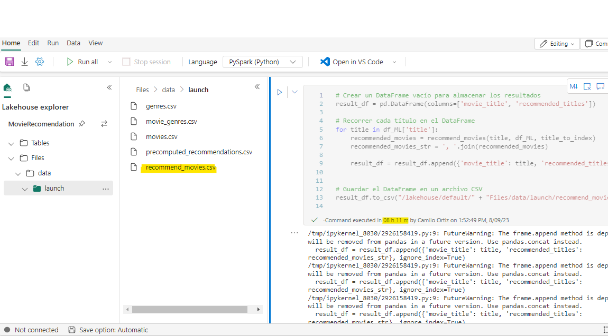

## 🚀 Modelos de Recomendación Basados en TF-IDF: Dos Enfoques Diferentes
En la fase de Machine Learning y Data Science, hemos aplicado la técnica TF-IDF para crear dos modelos de recomendación diferentes, cada uno con un enfoque distinto en el algoritmo. ¡Prepárate para descubrirlos! 💡

### Modelo 1: Coincidencia de Título, Género, Descripción y Popularidad 🎬🎭📝📊
#### Paso 1: Coincidencia de Título
Comenzamos por seleccionar películas que coinciden con el título ingresado. ¡Es como buscar gemas ocultas en la base de datos! 💎

#### Preprocesamiento:
Limpieza y normalización de los títulos (conversión a minúsculas, eliminación de puntuación, etc.). ✨

#### Medida de Similitud:
Utilización de técnicas como la comparación de la distancia del coseno o la similitud de Jaccard para calcular la similitud entre el título ingresado y los títulos en la base de datos. 🔍📊

#### Selección de Películas:
Selección de las películas con las similitudes más altas respecto al título ingresado. 🎯🎥

### Paso 2: Coincidencia de Género
Filtramos las películas seleccionadas en el paso anterior basándonos en la similitud de género. ¡Asegurémonos de que las películas compartan su ADN cinematográfico! 🧬🎞️

#### Preprocesamiento:
División de los géneros en palabras individuales si están separados por espacios. 📃

#### Medida de Similitud:
Utilización de medidas de similitud de texto como la distancia de Jaccard o la similitud de coseno para comparar los géneros ingresados y los géneros de las películas. ¡Coincidencia de géneros! 👥🎥

#### Filtrado por Género:
Selección de las películas que tienen géneros más similares a los ingresados. ¡Afinando la búsqueda! 🔍📜

### Paso 3: Coincidencia de Descripción
Refinamos las películas seleccionadas en base a la similitud de la descripción. ¡Vamos más allá de las palabras para encontrar verdaderas conexiones cinematográficas! 📃✨

#### Preprocesamiento:
Limpieza y normalización de las descripciones, de manera similar al paso de título. ✨

#### Representación de Descripciones:
Utilización de modelos de embeddings de palabras, como Word2Vec o GloVe, para representar las descripciones como vectores. ¡Convertimos palabras en números! 🔤➡️🔢

#### Medida de Similitud:
Cálculo de la similitud entre la descripción ingresada y las descripciones de las películas mediante medidas como la distancia del coseno. ¡Comparando las esencias cinematográficas! 🔍🎥

#### Selección Final:
Selección de las películas con las similitudes más altas en términos de descripción. ¡Las conexiones cinematográficas se vuelven más fuertes! 🎞️🤝

### Paso 4: Clasificación por Puntaje de Popularidad
Finalmente, ordenamos las películas seleccionadas según su puntaje de popularidad para presentar las mejores opciones al usuario. ¡Las favoritas del público tienen su lugar! 🌟📊

#### Ordenamiento:
Ordenamiento de las películas seleccionadas en función de sus puntajes de popularidad en orden descendente. ¡Las más populares en la cima! 🔝📊

#### Selección Final:
Selección de las 5 películas principales de la lista ordenada. ¡Las joyas del cine! 🏆🎬

>Este modelo nos permite abordar la recomendación de películas desde diferentes perspectivas, proporcionando a los usuarios un resultado más acertado. Seguiremos refinando y mejorando este modelo para brindar recomendaciones aún más precisas y relevantes en futuras actualizaciones del proyecto. ¡Mantente al tanto de las nuevas películas recomendadas! 🚀🍿

### Implementación y Optimización del Modelo de Recomendación
La implementación del modelo de recomendación basado en TF-IDF fue un proceso desafiante que requirió un enfoque cuidadoso para garantizar la eficiencia y la calidad de las recomendaciones. ¡Aquí te contamos cómo lo hicimos! 💻🛠️

#### Puesta en Marcha y Pruebas Iniciales
Una vez definido el enfoque del modelo, procedimos a implementar el algoritmo de recomendación basado en TF-IDF. Sin embargo, durante las pruebas iniciales, nos enfrentamos a un problema significativo: el modelo consumía una cantidad excesiva de recursos de memoria y tiempo. ¡Hora de solucionarlo! 🕰️🖥️

#### Optimización a Través de Microsoft Fabric
Para abordar este desafío, recurrimos a Microsoft Fabric, una solución de cómputo distribuido que nos permitió ejecutar el algoritmo de recomendación en un entorno escalable. ¡Le dimos una dosis de escalabilidad! ⚙️🔌



#### Optimización de Resultados Mediante Pregrabación de Recomendaciones
En la fase de implementación y optimización del modelo de recomendación, tomamos una medida estratégica para mejorar significativamente el rendimiento y la eficiencia del proceso, al pregrabar las recomendaciones para todas las películas en un archivo CSV. ¡Recomendaciones listas para servir! 📦🎬

#### Enfoque de Pregrabación
En lugar de calcular las recomendaciones en tiempo real directamente desde el algoritmo, optamos por generar anticipadamente un conjunto de recomendaciones para todas las películas en un archivo CSV. ¡Adelantándonos a las preferencias del usuario! 🔮📃

#### Justificación de la Pregrabación
El proceso de pregrabación se llevó a cabo debido a desafíos en el rendimiento y el tiempo de ejecución del algoritmo en conjuntos de datos más grandes. ¡Dando prioridad a la rapidez! 🏃‍♂️📈

#### Resultados y Beneficios
La pregrabación de recomendaciones para las películas permitió la creación de un archivo CSV que contenía todas las recomendaciones anticipadas. Esto mejoró el rendimiento del frontend y redujo la latencia en la plataforma. ¡Resultados rápidos y frescos! 🚀🎉

#### Proceso de Pregrabación
El proceso de generar el archivo CSV de recomendaciones para la muestra de 15,000 películas tomó aproximadamente 30 horas. Aunque llevó tiempo, garantizó un rendimiento eficiente y una respuesta rápida para los usuarios. ¡El esfuerzo valió la pena! ⏳💪

## 🔄 Modelo de Recomendación Optimizado: Eficiencia y Limitaciones
En la fase de desarrollo del segundo modelo de recomendación, empleamos un enfoque diferente para lograr eficiencia y mejoras notables en cuanto a consumo de memoria y tiempo de ejecución. ¡Descubre cómo lo hicimos! 💡🚀

### Código del Modelo Número 2
El siguiente es el código del segundo modelo de recomendación. ¡Echa un vistazo a la magia detrás de las recomendaciones! 💻🔍

```python
def preprocess_text(text):
    return text.lower()

def calculate_cosine_similarity(matrix):
    return cosine_similarity(matrix)

def calculate_jaccard_similarity(genre_list1, genre_list2):
    intersection = len(set(genre_list1).intersection(genre_list2))
    union = len(set(genre_list1).union(genre_list2))
    return intersection / union if union != 0 else 0.0

def precompute_matrix(column, vectorizer):
    matrix = vectorizer.fit_transform(column)
    return matrix

def get_similar_movies(similarity_matrix, reference_index):
    similar_movies = list(enumerate(similarity_matrix[reference_index]))
    similar_movies = sorted(similar_movies, key=lambda x: x[1], reverse=True)
    return similar_movies

def get_top_popular_movies(df_ML):
    df_ML_sorted = df_ML.sort_values(by='popularity', ascending=False)
    top_popular_movies = df_ML_sorted.iloc[:5]
    return top_popular_movies

def recommend_movies(title, df_ML, title_to_index):
    movie_index = title_to_index.get(title)
    if movie_index is None:
        return ["No se encontró la película en la base de datos."]
    
    similar_movies_title = get_similar_movies(titulo_similarity, movie_index)
    similar_movies_genre = [(i, calculate_jaccard_similarity(df_ML['genres_clean'][movie_index], row['genres_clean']))
                            for i, row in df_ML.iterrows()]
    similar_movies_description = get_similar_movies(descripcion_similarity, movie_index)
    
    all_similarities = [(idx, (sim_title + sim_genre + sim_description) / 3.0)
                        for (idx, sim_title), (_, sim_genre), (_, sim_description)
                        in zip(similar_movies_title, similar_movies_genre, similar_movies_description)]
    all_similarities = sorted(all_similarities, key=lambda x: x[1], reverse=True)
    
    recommended_movies = []
    for idx, _ in all_similarities:
        if idx != movie_index and len(recommended_movies) < 5:
            recommended_movies.append(df_ML.iloc[idx]['title'])
    
    return recommended_movies

# Cargar los datos y realizar preprocesamiento
#df_ML = pd.read_csv("data/launch/movies.csv")
df_ML['title_clean'] = df_ML['title'].apply(preprocess_text)
df_ML['genres_clean'] = df_ML['genres_name'].apply(lambda x: [genre.lower() for genre in x.split()])
df_ML['overview_clean'] = df_ML['overview'].apply(preprocess_text)

# Preparar matrices y cálculos de similitud
count_vectorizer = CountVectorizer(stop_words=nltk.corpus.stopwords.words('english'))
titulo_matrix = precompute_matrix(df_ML['title_clean'], count_vectorizer)
titulo_similarity = calculate_cosine_similarity(titulo_matrix)

descripcion_vectorizer = TfidfVectorizer(stop_words=nltk.corpus.stopwords.words('english'))
descripcion_matrix = precompute_matrix(df_ML['overview_clean'], descripcion_vectorizer)
descripcion_similarity = calculate_cosine_similarity(descripcion_matrix)

# Crear diccionario de indexación por título
title_to_index = {title: idx for idx, title in enumerate(df_ML['title'])}

```

```python
recommended_movies = recommend_movies('Ariel', df_ML, title_to_index)
print(recommended_movies)
```
```python
['Open Hearts',
 'Star Trek: Nemesis',
 'Man of Iron',
 "Boys Don't Cry",
 'The Cabinet of Dr. Caligari']
```

## 🔍 Diferencias Clave y Eficiencia

A diferencia del primer modelo que utilizó Título, Género, Descripción y Popularidad, el segundo modelo se centró en una estrategia más específica basada en la similitud de Título y Descripción. Aunque el primer modelo logró recomendaciones precisas y detalladas, enfrentamos desafíos de rendimiento debido a la complejidad y los recursos requeridos.

El segundo modelo, al enfocarse en solo dos atributos, logró un aumento significativo en la eficiencia. Aquí están las razones clave:

🔹 **Menos Cálculos de Similitud:** El segundo modelo calculó la similitud únicamente en base a Título y Descripción, reduciendo la cantidad de cálculos necesarios en comparación con el primer modelo que también consideró Género y Popularidad.

🔹 **Uso de Jaccard en Género:** El modelo 2 utilizó la similitud de Jaccard para comparar géneros, una medida más liviana en términos de cálculos que las técnicas de similitud basadas en vectores.

🔹 **Preproceso Simplificado:** El preproceso se simplificó en el segundo modelo, enfocándose principalmente en la limpieza de textos y la generación de matrices de similitud.

🔹 **Algoritmo de Precomputación:** En lugar de precomputar recomendaciones individuales, el segundo modelo optó por precomputar matrices de similitud entre títulos y descripciones, acelerando la generación de recomendaciones en tiempo real.

## 🚀 Ventajas y Limitaciones

El segundo modelo demostró ser altamente eficiente en términos de tiempo de ejecución y consumo de memoria. Sin embargo, esta eficiencia vino a expensas de la diversidad y riqueza de las recomendaciones. Al centrarse en solo dos atributos, algunas películas relacionadas por género pero diferentes en otros aspectos podrían no ser consideradas en las recomendaciones.

## ⚙️ Consideraciones Futuras

En el futuro, continuaremos evaluando y ajustando nuestros modelos para encontrar el equilibrio óptimo entre eficiencia y calidad de recomendación. Estamos explorando enfoques híbridos que combinen características clave de ambos modelos para ofrecer recomendaciones rápidas y diversas. El camino hacia la excelencia nunca termina. 🌟🔗
